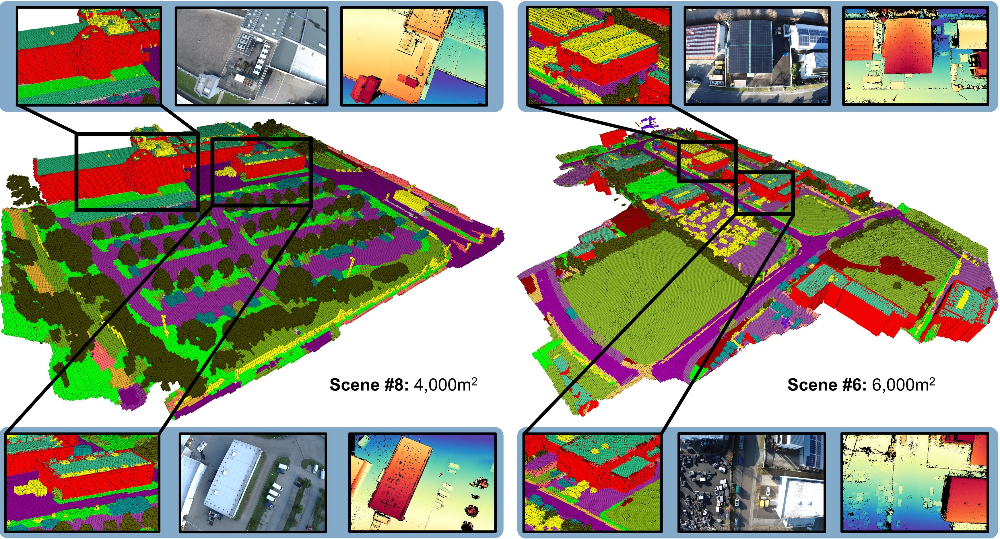

# OccuFly: A 3D Vision Benchmark for Semantic Scene Completion from the Aerial Perspective

### 🌟 CVPR 2026 🌟

&nbsp;&nbsp;

[Markus Gross](https://markus-42.github.io/)1,2,3,<a href="mailto:markus.gross@tum.de?subject=IPFormer" style="color: #4799e0; text-decoration: underline;">📧</a>,&nbsp;
[Sai B. Matha](https://www.linkedin.com/in/saibharadhwajmatha/)2,&nbsp;
[Aya Fahmy](https://www.linkedin.com/in/aya-fahmy-7373441bb/)1,&nbsp;
[Rui Song](https://rruisong.github.io/)4,&nbsp;
[Daniel Cremers](https://cvg.cit.tum.de/members/cremers/) 2,3,&nbsp;
[Henri Meeß](https://scholar.google.com/citations?user=7Qdm9jUAAAAJ&hl=en)1

1 [Fraunhofer IVI](https://www.ivi.fraunhofer.de/en/research-fields/advanced-air-mobility/autonomous-flying.html)&nbsp;&nbsp;&nbsp;&nbsp;&nbsp;
2
[TU Munich](https://cvg.cit.tum.de/)&nbsp;&nbsp;&nbsp;&nbsp;&nbsp;
3
[MCML](https://mcml.ai/research/groups/cremers/)&nbsp;&nbsp;&nbsp;&nbsp;&nbsp;
4
[UCLA](https://mobility-lab.seas.ucla.edu/)

⏳ **<i>Data and Code coming soon.</i>** Meanwhile, check out our [Project Page](https://markus-42.github.io/publications/2026/occufly/).

⭐ If you want receive the latest updates, consider giving this repo a star.

## 🚀 News
- **[2026/02]:** OccuFly was accepted to CVPR 2026 🥳
- **[2025/12]:** [Project page](https://markus-42.github.io/publications/2026/occufly/) online
- **[2025/12]:** [Preprint](https://arxiv.org/abs/2512.20770) available on arXiv