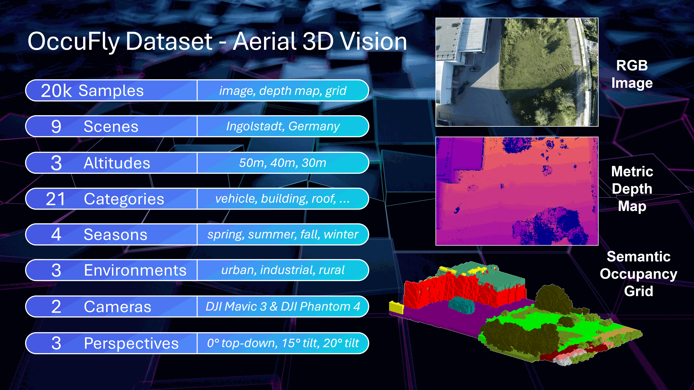
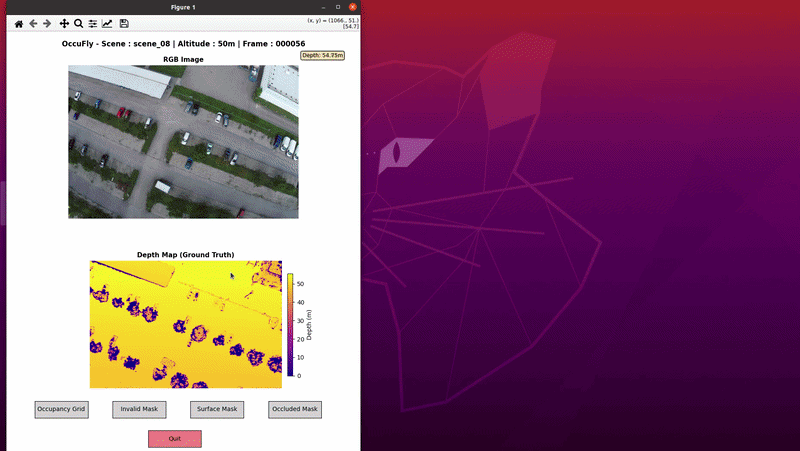

<div align="center">

# OccuFly: A 3D Vision Benchmark for Semantic Scene Completion from the Aerial Perspective

### 🌟 CVPR 2026 Oral 🌟

[](https://markus-42.github.io/publications/2026/occufly/)&nbsp;&nbsp;
[](https://arxiv.org/abs/2512.20770)
[](https://huggingface.co/datasets/markus-42/OccuFly)&nbsp;&nbsp;
[](https://huggingface.co/markus-42/OccuFly-DepthAnythingV2)

[Markus Gross](https://markus-42.github.io/)<sup>1,2,3,<a href="mailto:markus.gross@tum.de?subject=IPFormer" style="color: #4799e0; text-decoration: underline;">📧</a></sup>,&nbsp;
[Sai B. Matha](https://bharadhwajsaimatha.github.io/portfolio/)<sup>1</sup>,&nbsp;
[Aya Fahmy](https://www.linkedin.com/in/aya-fahmy-7373441bb/)<sup>1</sup>,&nbsp;
[Rui Song](https://rruisong.github.io/)<sup>4</sup>,&nbsp;
[Daniel Cremers](https://scholar.google.com/citations?user=cXQciMEAAAAJ&hl=en) <sup>2,3</sup>,&nbsp;
[Henri Meeß](https://scholar.google.com/citations?user=7Qdm9jUAAAAJ&hl=en)<sup>1</sup>

<sup>1</sup> [Fraunhofer Institute IVI](https://www.ivi.fraunhofer.de/en/research-fields/advanced-air-mobility/autonomous-flying.html)&nbsp;&nbsp;&nbsp;&nbsp;&nbsp;
<sup>2</sup>
[TU Munich](https://cvg.cit.tum.de/)&nbsp;&nbsp;&nbsp;&nbsp;&nbsp;
<sup>3</sup>
[MCML](https://mcml.ai/research/groups/cremers/)&nbsp;&nbsp;&nbsp;&nbsp;&nbsp;
<sup>4</sup>
[UCLA](https://mobility-lab.seas.ucla.edu/)


</div>

# News 🚀
- **[2026/06]:** [Aerial DepthAnything2](https://huggingface.co/markus-42/OccuFly-DepthAnythingV2) released on HuggingFace 🤗 
- **[2026/06]:** [OccuFly](https://huggingface.co/datasets/markus-42/OccuFly) released on HuggingFace 🤗 
- **[2026/02]:** OccuFly accepted to CVPR 2026 for oral presentation 🥳
- **[2025/12]:** [Project page](https://markus-42.github.io/publications/2026/occufly/) online
- **[2025/12]:** [Paper](https://arxiv.org/abs/2512.20770) available on arXiv

# Table of Contents
1. [Abstract](#1-abstract)
2. [Download OccuFly Dataset](#2-download-occufly-dataset)
3. [OccuFly Dataset Documentation](#3-occufly-dataset-documentation)
4. [Aerial Depth Estimation](#4-aerial-depth-estimation)
5. [Visualization Tool](#5-visualization-tool)
6. [Citation](#6-citation)
7. [License](#7-license)

# 1. Abstract

Semantic Scene Completion (SSC) is essential for 3D perception in mobile robotics, as it enables holistic scene understanding by jointly estimating dense volumetric occupancy and per-voxel semantics. Although SSC has been widely studied in terrestrial domains such as autonomous driving, aerial settings like autonomous flying remain largely unexplored, thereby limiting progress on downstream applications. Furthermore, LiDAR sensors are the primary modality for SSC data generation, which poses challenges for most uncrewed aerial vehicles (UAVs) due to flight regulations, mass and energy constraints, and the sparsity of LiDAR point clouds from elevated viewpoints. To address these limitations, we propose a LiDAR-free, camera-based data generation framework. By leveraging classical 3D reconstruction, our framework automates semantic label transfer by lifting <10% of annotated images into the reconstructed point cloud, substantially minimizing manual 3D annotation effort. Based on this framework, we introduce OccuFly, the first real-world, camera-based aerial SSC benchmark, captured across multiple altitudes and all seasons. OccuFly provides over 20,000 samples of images, semantic voxel grids, and metric depth maps across 21 semantic classes in urban, industrial, and rural environments, and follows established data organization for seamless integration. We benchmark both SSC and metric monocular depth estimation on OccuFly, revealing fundamental limitations of current vision foundation models in aerial settings and establishing new challenges for robust 3D scene understanding in the aerial domain.

# 2. Download OccuFly Dataset
OccuFly is hosted on Hugging Face: [OccuFly Dataset](https://huggingface.co/datasets/markus-42/OccuFly). To download it, follow these steps:

#### Install Dependencies:

```bash
pip install huggingface-hub tqdm numpy Pillow
```

#### Download Dataset:

Use `src/download_occufly.py` to download the dataset. There are multiple options:


```bash
# Download all scenes
python download_occufly.py

# Download specific split
python download_occufly.py --split train
python download_occufly.py --split validation
python download_occufly.py --split test

# Download specific scenes (1-9)
python download_occufly.py --scenes 1 2 3

# Include predicted depth maps
python download_occufly.py --include_depth_predictions
python download_occufly.py --split train --include_depth_predictions

# Download only predicted depth maps
python download_occufly.py --only_depth_predictions

# Custom output directory
python download_occufly.py --output ./my_data
```


# 3. OccuFly Dataset Documentation

<p align="center">
    
</p>

For detailed documentation, check the following readme files:

- **[Dataset Notes](docs/dataset_notes.md)**: Overall attributes, and technical specifications of the voxel grid, semantic classes, coordinate system, grid indexing, and missing frames.
- **[Directory Structure](docs/directory_structure.md)**: Dataset splits, and an overview of the dataset folder organization across scenes, altitudes, and data types.
- **[File Descriptions](docs/file_description.md)**: Detailed documentation of each file format, including ground truth-files, preprocessed data, and calibration information.


# 4. Aerial Depth Estimation

For metric monocular depth estimation, we provide a fine-tuned checkpoint of [Depth Anything V2](https://github.com/DepthAnything/Depth-Anything-V2) that predicts absolute depth values (in meters) from single aerial RGB images captured at varying flight altitudes (30m, 40m, 50m). The model is fine-tuned on OccuFly depth maps.

**Note** that we provide predicted depth maps from this model already in the dataset. In other words, you don´t need to infer OccuFly depth maps yourself.

If you want to infer other images than OccuFly, then **find the model and instructions on Hugging Face**: [markus-42/OccuFly-DepthAnythingV2](https://huggingface.co/markus-42/OccuFly-DepthAnythingV2)


# 5. Visualization Tool

We provide a tool that visualizes images, depth maps, and ground-truth semantic voxel grids (including surface, occluded, and invalid masks). To run it, follow these steps:

### Prerequisites
- Python >= 3.9

### Installation

1. Clone the repository:
    ```bash
    git clone https://github.com/markus-42/occufly.git
    cd occufly
    ```

2. Create a virtual environment (optional but recommended):
    ```bash
    python -m venv venv
    # On Windows
    venv\Scripts\activate
    # On macOS/Linux
    source venv/bin/activate
    ```

3. Install the required dependencies:
    ```bash
    pip install -r requirements.txt
    ```

4. Install Open3D:

    Open3D requires specific installation steps. Please follow the official instructions at:
    [https://www.open3d.org/docs/0.19.0/getting_started.html](https://www.open3d.org/docs/0.19.0/getting_started.html)


### Usage

**Run the Script:**

```bash
python src/visualize_gt.py --base_dir /path/to/OccuFly --scene scene_01 --altitude 30 --frame 000000
```
- `--base_dir` (required): Path to the OccuFly root directory containing the `OccuFly_Dataset` folder
- `--scene` (optional, default: scene_01): Scene identifier (e.g., scene_01, scene_02, ...)
- `--altitude` (optional, default: 30): Flight altitude in meters (choices: 30, 40, 50)
- `--frame` (optional, default: 000000): Frame ID with zero-padding (e.g., 000000, 000001, ...)

**Features**:
- Left panel: RGB image and depth map visualization
- Right panel: Interactive 3D voxel grid rendering
- Mask switching: Toggle between surface, occluded, invalid, and occupancy masks
- Depth inspection: Hover over the depth map to view depth values

**Note**: 

Ensure your dataset is organized according to the [Directory Structure](docs/directory_structure.md) documentation. Otherwise, update the script paths accordingly.

<div align="center">



</div>


# 6. Citation

If this repository or our work was helpful to you,  we would appreciate citing our paper and giving the repository a star ⭐

```bibtex
@inproceedings{gross2026occufly,
    title={{OccuFly: A 3D Vision Benchmark for Semantic Scene Completion from the Aerial Perspective}}, 
    author={Markus Gross and Sai B. Matha and Aya Fahmy and Rui Song and Daniel Cremers and Henri Meess},
    booktitle = {Proceedings of the IEEE/CVF Conference on Computer Vision and Pattern Recognition (CVPR)},
    year={2026},
}
```

# 7. License

This work is licensed under the [CC BY-NC-SA 4.0 license](https://creativecommons.org/licenses/by-nc-sa/4.0/). See the LICENSE file for the full legal terms.
